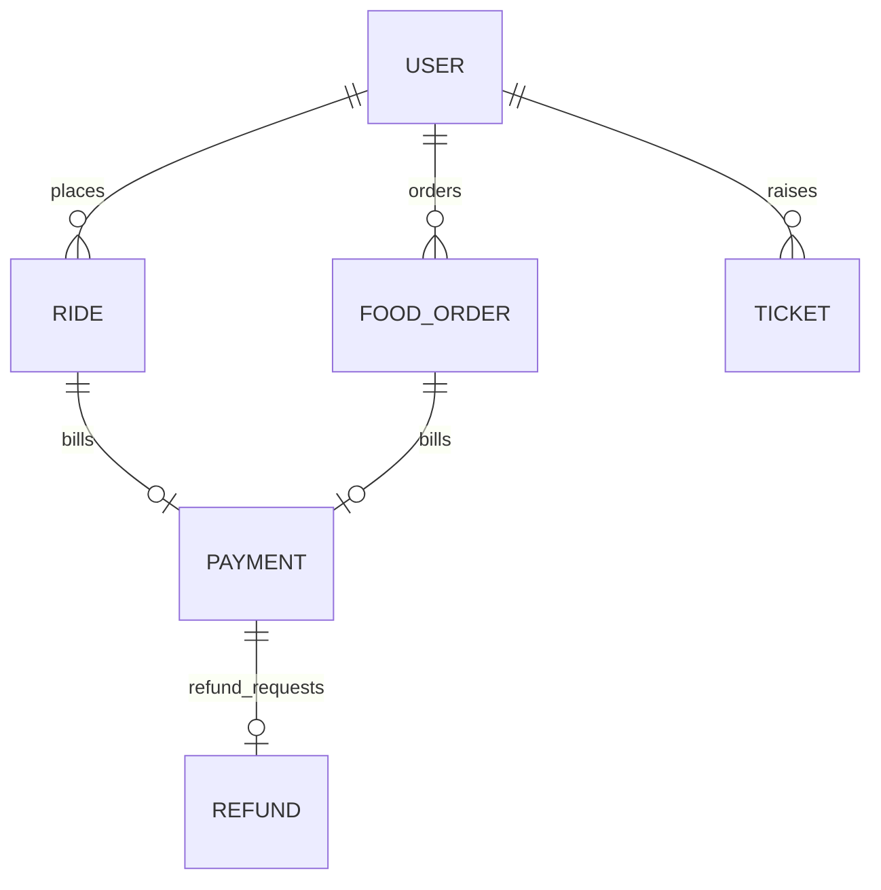

# Tài liệu Thiết kế Lược đồ Dữ liệu Mock Backend

Tài liệu này thuyết minh chi tiết thiết kế cấu trúc dữ liệu cho tệp CSDL giả lập [mock_backend_data.json](file:///c:/Users/Administrator/Developer/Intern_VSF/voice-chatbot-agent/app/database/mock_backend_data.json) và lược đồ kiểm thử dữ liệu tại [mock_backend_schema.json](file:///c:/Users/Administrator/Developer/Intern_VSF/voice-chatbot-agent/app/database/mock_backend_schema.json).

---

## 1. Mô hình Thực thể và Mối quan hệ (ER Model)

Hệ thống quản lý 6 thực thể dữ liệu chính liên kết chặt chẽ với nhau để mô phỏng vòng đời dịch vụ:

- **Users (Khách hàng):** Đại diện cho hành khách đặt dịch vụ xe hoặc đồ ăn.
- **Rides (Chuyến xe):** Lưu lịch sử di chuyển, thông tin tài xế, cước phí và trạng thái đặt xe.
- **Food Orders (Đơn hàng đồ ăn):** Lưu thông tin nhà hàng, danh sách món ăn, trạng thái giao nhận và tình trạng thiếu món.
- **Payments (Thanh toán):** Bản ghi giao dịch thanh toán gốc gắn với chuyến xe hoặc đơn hàng đồ ăn.
- **Refunds (Hoàn tiền):** Yêu cầu bồi hoàn tiền khi có lỗi xảy ra (ví dụ: thiếu món ăn, tài xế không tới đón).
- **Tickets (Phiếu hỗ trợ):** Ghi nhận khiếu nại chưa xử lý được ngay để chuyển tiếp nhân viên hỗ trợ trực tiếp.

---

## 2. Chi tiết cấu trúc các Thực thể dữ liệu

### Bảng Chuyến xe (Rides)
- **searching:** Đang tìm tài xế (ví dụ: `R104`).
- **arriving:** Tài xế đang đến đón (ví dụ: `R101` - kịch bản tài xế đến trễ đón).
- **completed:** Đã hoàn thành hành trình đón trả khách (ví dụ: `R102`, `R105`).
- **cancelled:** Đã bị hủy bỏ bởi hành khách hoặc tài xế (ví dụ: `R103`).

### Bảng Đơn hàng Đồ ăn (Food Orders)
- **preparing:** Nhà hàng đang làm món (ví dụ: `F201` - Bún Chả Sinh Từ).
- **delivering:** Shipper đang giao món đi (ví dụ: `F203` - Pizza Company).
- **completed:** Đã giao tới khách hàng (ví dụ: `F202` - Burger King, giao thiếu món khoai tây chiên).

### Bảng Chính sách nghiệp vụ (Policies)
Hệ thống cấu hình sẵn một bộ điều khoản chính sách chung của nền tảng dịch vụ:
1. **Phí hủy chuyến xe (`ride_cancellation_fee`):** Cố định **10,000 VND**.
2. **Quy định hủy chuyến (`ride_cancellation_policy`):** Áp dụng phạt phí khi khách hàng tự ý hủy chuyến xe sau 2 phút từ lúc tài xế nhận chuyến hoặc khi tài xế đã di chuyển tới điểm đón đón hành khách.
3. **Quy định hoàn tiền đồ ăn (`food_refund_policy`):** Hoàn lại 100% giá trị của món bị thiếu/sai theo giá tiền trong hóa đơn thanh toán.
4. **Cam kết hỗ trợ SLA (`support_sla`):** SLA dưới 24h đối với sự cố tài chính, dưới 12h đối với sự cố giao nhận đồ ăn thiếu.

---

## 3. Thống kê Dữ liệu giả lập (Mock Records Statistics)

Tập tin dữ liệu mock chứa tổng cộng **53 bản ghi** (vượt xa chỉ tiêu 50 test cases tối thiểu):

- **Users:** 5 bản ghi.
- **Rides (Lịch sử đặt xe):** 15 bản ghi (phân bổ đa dạng trạng thái và thời gian khác nhau).
- **Food Orders (Lịch sử đơn ăn):** 15 bản ghi (nhiều nhà hàng, món ăn, và trạng thái chuẩn bị/đang giao/giao xong).
- **Payments (Lịch sử hóa đơn):** 13 bản ghi.
- **Refunds (Lịch sử hoàn tiền):** 2 bản ghi.
- **Tickets (Lịch sử cứu trợ):** 2 bản ghi.
- **Policies (Quy chế điều khoản):** 1 bản ghi.

Tất cả dữ liệu được biên soạn bằng tiếng Việt chuẩn UTF-8 để phục vụ cho các bước đánh giá và đối sánh kết quả hội thoại tự nhiên của Chatbot.
