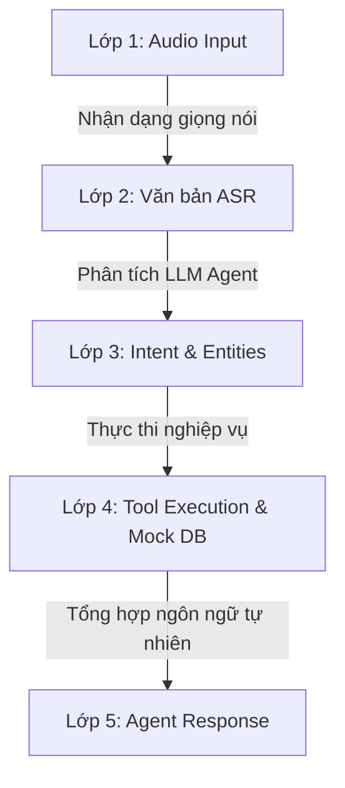

# Tài liệu Đặc tả Kiểm thử (Test Specification) - Voice Chatbot Agent

Tài liệu này đặc tả thiết kế các phân lớp dữ liệu kiểm thử, ma trận kịch bản kiểm thử (Test Cases) và phương pháp xác thực tính đúng đắn cho hệ thống Voice Chatbot Agent đặt xe và đặt đồ ăn.

---

## 1. Mục tiêu Kiểm thử
Đảm bảo pipeline hoạt động ổn định và chính xác theo luồng:
$$\text{Audio Input} \xrightarrow{\text{ASR}} \text{Văn bản (Transcript)} \xrightarrow{\text{Agent/LLM}} \text{Gọi Tool} \xrightarrow{\text{Mock DB}} \text{Phản hồi tự nhiên}$$

Kiểm thử tập trung vào khả năng trích xuất ý định của Agent, quyết định gọi đúng công cụ nghiệp vụ, và phản hồi thân thiện, chính xác theo chính sách của nền tảng dịch vụ.

---

## 2. Thiết kế các Phân lớp Dữ liệu Kiểm thử (Test Data Layers)

Hệ thống kiểm thử được thiết kế dựa trên mô hình chia lớp dữ liệu từ thô (âm thanh) đến có cấu trúc (giao dịch DB):

### Lớp 1: Dữ liệu Âm thanh Đầu vào (Audio Input Layer)
- **Định dạng chuẩn:** Tệp `.wav`, tần số lấy mẫu `16kHz`, kênh đơn (mono), mã hóa `16-bit PCM`.
- **Phân nhóm dữ liệu âm thanh:**
  - *Audio chuẩn (Clean Speech):* Giọng đọc rõ ràng trong môi trường yên tĩnh.
  - *Audio nhiễu (Noisy Speech):* Giọng nói có tiếng ồn giao thông, tiếng nhạc nền quán ăn để thử nghiệm độ bền của ASR.
  - *Audio vùng miền:* Giọng đọc ba miền Bắc - Trung - Nam để đánh giá tính thích ứng của bộ giải mã âm thanh.

### Lớp 2: Văn bản Nhận diện từ ASR (ASR Transcription Layer)
- **Văn bản chuẩn (Clean Transcript):** Câu nói đầy đủ ngữ pháp, đúng chính tả tiếng Việt.
- **Văn bản lỗi/Chịu lỗi (Perturbed/Noisy Transcript):**
  - Thiếu dấu tiếng Việt (ví dụ: *tai xe den tre qua* thay vì *tài xế đến trễ quá*).
  - Lỗi đồng âm/sai chính tả nhẹ do nhận dạng sai (ví dụ: *chuyến xe rờ một không một* thay vì *chuyến xe R101*).
  - LLM Agent ở các bước sau phải có khả năng hiểu và sửa lỗi từ vựng này để chọn đúng công cụ.

### Lớp 3: Trích xuất Ý định & Thực thể (Intent & Entity Layer)
Phân tích văn bản thành các cặp giá trị:
- **Intents (Ý định khách hàng):**
  - `check_ride_status`: Kiểm tra trạng thái tài xế, chuyến xe.
  - `cancel_ride`: Hủy chuyến xe đang đặt.
  - `check_food_order_status`: Kiểm tra đơn hàng đồ ăn.
  - `check_ride_cancellation_fee`: Hỏi nguyên nhân bị trừ phí hủy chuyến.
  - `request_refund`: Yêu cầu hoàn trả tiền.
  - `escalate_to_support`: Chuyển tiếp tới nhân viên hỗ trợ trực tiếp.
- **Entities (Thực thể hành động):**
  - `ride_id`: Định dạng `R` + 3 chữ số (ví dụ: `R101`).
  - `order_id`: Định dạng `F` + 3 chữ số (ví dụ: `F202`).
  - `payment_id`: Định dạng `PAY` + 3 chữ số (ví dụ: `PAY202`).
  - `missing_item`: Tên món ăn bị giao thiếu (ví dụ: `Khoai tây chiên cỡ lớn`).

### Lớp 4: Lớp Thực thi Công cụ & Mock DB (Tool Execution & Mock DB Layer)
- **Đầu vào (Input Parameters):** Tham số được chuẩn hóa từ thực thể trích xuất ở Lớp 3.
- **Trạng thái Cơ sở dữ liệu (Database State):**
  - Trạng thái ban đầu: Bản ghi trong `mock_db.py` với trạng thái cụ thể (`arriving`, `completed`, `cancelled`).
  - Trạng thái sau thực thi: Trạng thái bản ghi chuyển đổi (ví dụ: chuyến xe từ `arriving` chuyển sang `cancelled`).
- **Kết quả trả về:** Dạng từ điển Python/JSON làm đầu vào cho lớp sinh phản hồi.

### Lớp 5: Phản hồi của Agent (Agent Response Layer)
- **Tiêu chuẩn phản hồi (Response Criteria):**
  - Thân thiện, lịch sự, xưng hô phù hợp (Dạ, cảm ơn, xin lỗi).
  - Đưa ra đúng thông tin truy vấn (Tên tài xế, biển số xe, ETA, danh sách món thiếu).
  - Thực hiện đúng chính sách nền tảng (phí hủy chuyến 10,000 VND, hoàn tiền đúng số tiền của món bị thiếu).
  - Có phương án hướng dẫn rõ ràng (ví dụ: hoàn tiền về tài khoản trong 1-3 ngày làm việc).

---

## 3. Ma trận Kịch bản và Ca Kiểm thử (Test Cases Matrix)

| Mã TC | Phân loại | Tệp Âm thanh Giả lập | Văn bản Đầu vào ASR (Transcript) | Intent | Tool Gọi | Tham số Tool | Phản hồi Mong muốn từ Agent |
| :--- | :--- | :--- | :--- | :--- | :--- | :--- | :--- |
| **TC-01** | Đặt xe | `P001_driver_late.mp3` | "Tài xế của tôi đang ở đâu thế, trong app báo 5 phút nữa tới mà tôi đợi 15 phút rồi." | `check_ride_status` | `get_ride_status` | `ride_id="R101"` | Xác nhận trạng thái chuyến xe R101 là đang đến (`arriving`), hiển thị thông tin tài xế Lê Văn C, biển số 29A-12345 và ETA là 5 phút. |
| **TC-02** | Đồ ăn | `P012_missing_item.mp3` | "Đơn F202 giao thiếu phần khoai tây chiên của tôi rồi, làm việc kiểu gì vậy?" | `check_food_order_status` | `get_food_order_status` | `order_id="F202"` | Xác nhận đơn hàng F202 đã giao nhưng thiếu món "Khoai tây chiên cỡ lớn". Đề xuất hoàn tiền hoặc chuyển hỗ trợ. |
| **TC-03** | Thanh toán | `P004_payment_error.mp3` | "Tôi bị trừ 10 nghìn phí hủy chuyến R103 dù lỗi là do tài xế không tới." | `check_ride_cancellation_fee` | `get_ride_status` | `ride_id="R103"` | Giải thích chuyến xe R103 đã bị hủy bởi khách và áp dụng phí hủy chuyến 10,000 VND do hủy khi tài xế đang di chuyển. |
| **TC-04** | Hoàn tiền | `P016_refund_request.mp3` | "Tôi muốn hoàn tiền cho giao dịch PAY202 do thiếu món." | `request_refund` | `request_refund` | `payment_id="PAY202"`, `amount=35000` | Xác nhận tạo yêu cầu hoàn tiền thành công 35,000 VND cho giao dịch PAY202 và thông báo thời gian nhận tiền từ 1-3 ngày. |
| **TC-05** | Hỗ trợ | `P008_escalate.mp3` | "Tôi muốn khiếu nại thái độ của tài xế R101, hãy chuyển cho nhân viên xử lý." | `escalate_to_support` | `create_support_ticket` | `user_id="U001"`, `category="customer_complaint"` | Xác nhận đã tạo ticket hỗ trợ thành công (ví dụ: mã TKT801) và sẽ có nhân viên liên hệ lại sớm nhất. |

---

## 4. Phương án Tự động hóa Kiểm thử (Testing Automation Plan)

Bộ kiểm thử tự động sử dụng thư viện **Pytest** và **FastAPI TestClient** để thực hiện kiểm thử tự động ở 3 cấp độ:

1. **Unit Test (Database & Services):**
   - Xác thực các thao tác dữ liệu trên `MockDatabase` trong `tests/test_mock_db.py`.
   - Xác thực logic nghiệp vụ và cuộc gọi công cụ của `AgentService` trong `tests/test_services.py`.
2. **Integration Test (API Endpoints):**
   - Gửi yêu cầu kiểm thử tích hợp giả lập tệp tin âm thanh lên endpoint `/api/v1/chatbot/voice` trong `tests/test_api.py`.
   - Xác nhận phản hồi JSON trả về đúng định dạng chuẩn cấu trúc pipeline.
